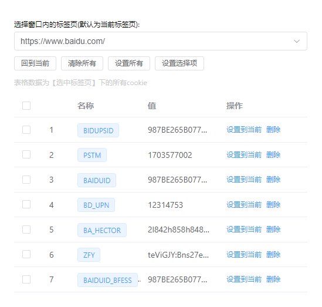

# g-crx-vue

vue3+vite 开发构建 chrome 扩展 & 一个管理浏览器 cookie 的扩展

[](https://cn.vitejs.dev)
[](https://opensource.org/licenses/)

## 预览



## 本地运行&开发

克隆项目

```bash
  git clone https://github.com/juxiu/g-crx-vue.git
```

进入目录

```bash
  cd g-crx-vue
```

安装依赖

```bash
  npm install
```

运行

```bash
  npm run build:watch
```

chrome 扩展管理中加载已解压的扩展程序,选择 dist 目录

## License

[MIT](https://choosealicense.com/licenses/mit/)
